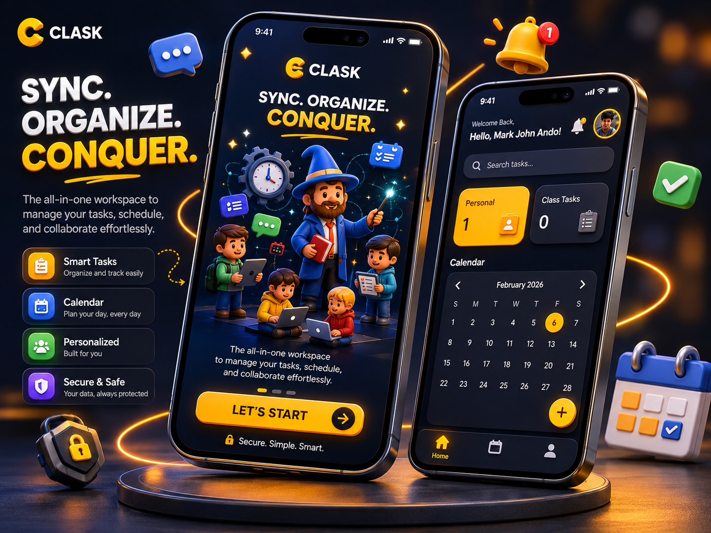
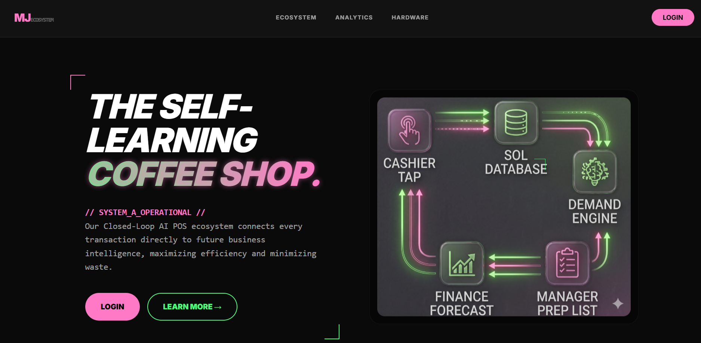
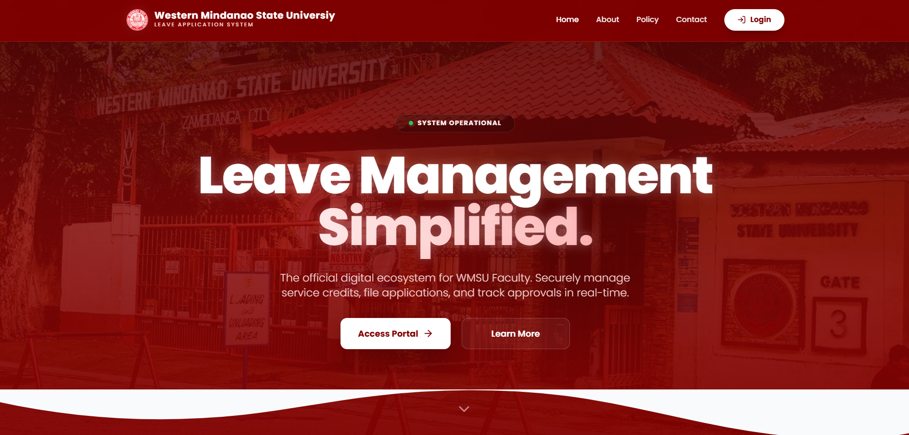
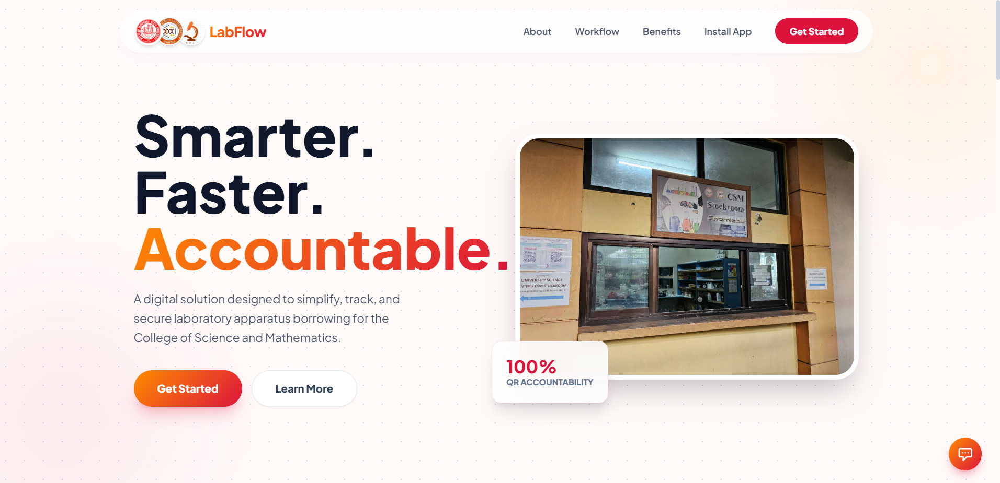

# Hi there, I'm Mark John Ando 👋

  

  
  

---

### 🚀 About Me

- 💻 **Full-Stack Developer** focused on architecting robust backend systems, intuitive client workflows, and modern nocturnal/dark-mode interfaces.
- 🛠️ **Engineering Mindset:** Building production-oriented architectures across native PHP MVC platforms, RESTful backends, Django machine learning integrations, and native Android applications.
- 🎯 **Primary Focus:** Scalable web APIs, relational database optimization, mobile system design, and predictive analytical suites.

---

### 🛠️ Tech Stack & Toolkit

**Languages**

  
  
  
  
  
  

**Frameworks & Libraries**

  
  
  
  
  

**Databases & Storage**

  
  
  

**Tools & Platforms**

  
  
  
  
  
  
  

---

### 📂 Featured Open Source & Projects

| Preview | Project & Stack | Description |
| :---: | :--- | :--- |
|  | **[Clask](https://github.com/mark92233/final_mad)**       | Native Android & client-server collaborative academic suite featuring role-based classrooms, token registration, modal discussion threads, and visual calendar scheduling. |
|  | **[Coffee POS & Forecast](https://github.com/mark92233/ando_final_cc105)**     | Intelligent coffee shop management platform pairing transactional POS/inventory modules with serialized ML pipelines for demand, revenue, and depletion forecasting. |
|  | **[Cebu Dorm Finder](https://github.com/mark92233/cebu-dorm-finder)**      | Localized housing discovery engine for students in Cebu featuring geospatial university proximity mapping, OTP-backed account verification, and automated rental group scrapers. |
|  | **[WMSU Leave Application System](https://github.com/mark92233/WMSU_LEAVE_APPLICATION_SYSTEM)**     | Digitized administrative leave evaluation portal supporting multi-tiered review pipelines, audit trails, programmatic leave certificate PDF rendering, and automated SMTP alerts. |
|  | **[LabFlow](https://github.com/mark92233/LabFlow)**      | College of Science and Mathematics laboratory management platform featuring QR-driven inventory tracking, forensic accountability, apparatus borrowing workflows, and audit logging. |

---

### 📊 GitHub Activity & Metrics

  
  

  

---

### 📫 Connect With Me

- **Portfolio:** [ando-mark-portfolio.vercel.app](https://ando-mark-portfolio.vercel.app)
- **GitHub:** [@mark92233](https://github.com/mark92233)
